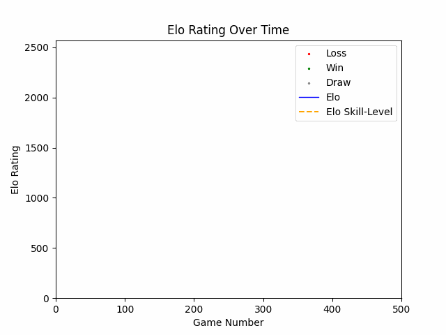

# Dynamic Chess Elo Rating System

A Python-based dynamic Elo rating system for calculating and updating chess player ratings based on game results.

## Overview

This project implements an Elo rating system that dynamically updates player ratings following each game. The system can be used to track changes in player ratings and analyse rating progression over time.
Games are simulated via monte-carlo simulation based on players defined real skill level and their derived winning probabilities.

## Features

- Dynamic Elo rating calculation
- Rating updates based on game results
- Visualisation of Elo ratings against number of games played
- Adjustable rating parameters
